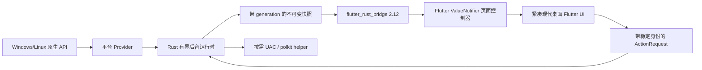

# taskmgr-rs Flutter 跨平台迁移实施计划

| 字段 | 内容 |
| --- | --- |
| 文档类型 | 架构迁移实施规格与执行清单 |
| 版本目标 | `v0.3.0` |
| 日期 | 2026-08-20 |
| 作者 | JamesLinYJ |
| 协助 | OpenAI Codex:gpt-5.6-sol |
| 参考标准 | Linux kernel UAPI、procfs、sysfs、DRM sysfs ABI、Wayland/EWMH、Win32/PDH/WTS/IP Helper、Flutter desktop、FRB 2.12 |
| 状态 | 实施中 |

## 1. 决策摘要

本次迁移用 Flutter 直接替换现有 Win32 UI，Rust 继续负责系统采样、快照一致性、危险操作和平台 API。现有 Rust/Win32 界面用于确定菜单、七个标签页、表格列、按钮顺序、对话框和图表语义；新前端保留这套结构与操作习惯，并用统一、克制的现代桌面主题呈现，而不逐像素复制 Win32 Classic 皮肤。

已锁定的产品边界：

- 支持 Windows 与 Linux 的 x64、ARM64；删除 Windows x86。
- 保留系统标题栏和窗口边框，不实现自绘标题栏。
- Windows/Linux 使用同一套 Flutter 控件树；平台差异由 Rust 能力模型与真实数据表达。
- 不把 Linux 数据近似伪装成 Windows 指标；整项不支持则隐藏，单值不可得则显示“不可用/权限不足”，不使用假 `0`。
- 七页在首个 Flutter 正式版本中全部存在：应用程序、进程、性能、CPU、GPU、网络、用户。
- 旧注册表设置不迁移、不删除；新版使用独立版本化 JSON 设置。
- 主 GUI 永远使用普通权限；受保护数据和动作通过按需 helper 获取。
- 发布物是标准 Flutter 多文件 bundle，不追求单 EXE。

## 2. 目标架构

### 2.1 仓库布局

```text
taskmgr-rs/
├── crates/
│   ├── taskmgr-core/       # DTO、快照、设置、单飞运行时、操作协议
│   ├── taskmgr-linux/      # procfs/sysfs/DRM/utmpx/X11/Wayland
│   ├── taskmgr-windows/    # Win32/PDH/WMI/DXGI/WTS 采集与动作
│   ├── taskmgr-bridge/     # 唯一 FRB cdylib；Cargo 包/产物名 taskmgr_native
│   └── taskmgr-helper/     # UAC/polkit 白名单 helper
├── flutter_app/            # Windows/Linux Flutter 桌面应用
├── packaging/              # Inno Setup、DEB、RPM、polkit 与便携包清单
└── docs/                   # 兼容矩阵、视觉基线和本计划
```

Rust 内部 crate 使用 `rlib` 连接。Flutter 只加载一个动态库：Windows 为 `taskmgr_native.dll`，Linux 为 `libtaskmgr_native.so`。helper 是独立可执行文件，不是第二个前端动态库。

### 2.2 桌面窗口与图像依赖决策

- 固定使用 `window_manager 0.5.2`（MIT）应用系统窗口尺寸、最大化、最小化与 always-on-top。Flutter SDK 本身没有覆盖 Windows/Linux 这些桌面窗口动作的统一公开接口；该插件只控制系统窗口，不绘制客户区或标题栏。
- 固定直接依赖 `screen_retriever 0.2.2`（MIT），仅用于确认保存的位置仍与某个显示器工作区相交。虽然它也是 `window_manager` 的传递依赖，但直接导入其 API 时必须显式声明，避免依赖偶然的传递导出。
- 固定使用 `tray_manager 0.5.3`（MIT）接入 Windows 通知区域与 Linux AppIndicator。Flutter SDK 与现有 `window_manager` 都不提供托盘图标、托盘菜单或通知区域鼠标事件；Linux 构建依赖 `ayatana-appindicator3-0.1` 或 `appindicator3-0.1`，GNOME 缺少 AppIndicator 扩展时只报告部分支持，不能启用“最小化时隐藏”。
- 固定使用纯 Rust `png 0.18.1`（MIT OR Apache-2.0）把 Windows GDI 小图标和 X11 `_NET_WM_ICON` 像素编码为现有 `icon_png` 协议字段。标准库、Win32 GDI、X11RB 与 FRB 都不提供 PNG 编码器；依赖只在对应平台 crate 中编译，不进入 UI 或增加部署动态库。
- 三项许可证随 Flutter 生成的 `data/flutter_assets/NOTICES.Z` 进入发布 bundle；Linux 插件 `.so` 必须使用相对 `$ORIGIN` RUNPATH，禁止携带构建机路径。

### 2.3 数据流



平台采集器只能提交完整候选快照。采样失败时运行时发布“上一份可信快照 + 当前结构化错误”；没有历史快照时发布 `PageUnavailable`，不能以空表冒充成功。

## 3. 稳定公开接口

FRB 对 Flutter 暴露以下接口，方法默认异步执行，Flutter UI isolate 不进行系统采样：

```text
startBackend(BackendOptions) -> BackendHandle
watchBackend(BackendHandle) -> Stream<BackendEvent>
updateOptions(BackendHandle, BackendOptions)
requestRefresh(BackendHandle, PageId?)
openPrivilegedSession(BackendHandle) -> PrivilegeResult
executeAction(BackendHandle, ActionRequest) -> ActionResult
loadSettings() -> SettingsLoadResult
saveSettings(UiSettings)
shutdownBackend(BackendHandle)
```

关键类型约束：

- `PlatformCapabilities` 描述页面、列、动作、托盘、提权和桌面协议的支持程度。
- `BackendEvent` 是能力变化、七页快照、页面不可用和权限状态的带标签联合类型。
- `SnapshotMeta` 包含 `generation`、采样时间、`stale` 和结构化错误。
- `ProcessIdentity` 必须包含 PID 与平台启动时间；选择、缓存和危险操作均不得只保存 PID。
- `ActionRequest` 只允许白名单动作；helper 协议不接受命令行、脚本或任意可执行路径。
- 进程、GPU、网络等单值使用可空字段表达缺失；只有成功采样确实为空时才返回空集合。

## 4. UI 结构复刻与桌面视觉规格

### 4.1 视觉来源

- 现有 Win32 DLU 用于恢复主窗口、七页和对话框的结构比例；Flutter 使用统一内置 Noto Sans，并以当前 Flutter golden 作为正式视觉基准。
- 主窗口标题、菜单层级、标签顺序和状态栏文本保持现有定义。
- 表头顺序、默认列宽、对齐方式和按钮相对位置沿用现有页面常量，不引入侧栏、悬浮导航、移动端重排或现代大间距。
- 视觉采用中性浅灰背景、白色工作区、蓝色交互强调、小圆角、轻阴影与柔和分隔；不直接套用 Material 默认控件皮肤。
- 图表保留绿色用户/总量曲线、红色内核曲线、黄色辅助曲线、采样方向与历史窗口，背景和网格改由 `DesktopTheme` 统一定义。
- 系统标题栏、不同系统的文字 hinting 和 GPU 栅格化差异不纳入比较；100% 缩放核对当前 golden，125%、150%、200% 验证无溢出。

### 4.2 Flutter 组件

- `DesktopMenuBar`：实现文件、选项、查看、窗口、帮助及页面专属菜单。
- `DesktopTabs`：七页固定顺序，支持键盘切换、可见焦点和窄窗口省略。
- `DesktopDataTable`：基于 `two_dimensional_scrollables/TableView`，支持虚拟化、表头排序、列宽调整、选择保持和右键菜单。
- `DesktopGroupBox`、`DesktopButton`、`DesktopCheckbox`、`DesktopStatusBar`：统一圆角、边框、字体、hover、禁用态和焦点态。
- `DesktopGraph`、`DesktopMeter`：使用 `CustomPainter`，仅在历史或尺寸变化时重绘。
- 所有自定义交互控件提供 Flutter `Semantics`、键盘顺序和错误状态文本，颜色不是唯一状态信号。

### 4.3 页面映射

| 页面 | 保持的 Win32 结构 | Linux 差异 |
| --- | --- | --- |
| 应用程序 | 任务表、切换到、结束任务、运行 | X11 使用 EWMH；Wayland 按协议能力启用动作 |
| 进程 | 虚拟列表、选列、结束/结束树、优先级、亲和性 | 使用 nice、FD、RSS、cgroup 等真实字段 |
| 性能 | CPU/内存仪表、历史图、Totals/Memory/Commit/Kernel 分组 | 无严格等价项显示不可用，不伪造分页池 |
| CPU | 型号、总图、当前状态、拓扑、功能、缓存 | 数据来自 procfs/sysfs/架构能力 |
| GPU | 适配器、四引擎、显存图、当前值和详情 | DRM 驱动提供多少展示多少，明确部分支持 |
| 网络 | 网卡表、每接口吞吐和历史 | 数据来自 sysfs/rtnetlink 语义 |
| 用户 | 会话表、断开、注销、发消息 | utmpx/logind 能力分层，动作需要 helper |

## 5. 平台后端

### 5.1 Linux

- 进程与系统：`/proc/<pid>/stat`、`status`、`fd`、`cgroup`、`/proc/stat`、`meminfo`、`cpuinfo`。
- CPU：sysfs cpufreq/topology/cache；不依赖 CPU 型号硬编码表。
- 网络：rtnetlink 枚举，sysfs 计数器与链路速度；累计计数处理首次样本、回退和接口重建。
- GPU：`/sys/class/drm` 和已文档化的驱动 sysfs 属性；没有的指标保持空值。
- 用户：utmpx 用于基础登录会话，systemd-logind D-Bus 用于可用时的完整会话与控制。
- 应用程序优先 Wayland：依次尝试 `ext-foreign-toplevel-list-v1`、wlroots、KDE Plasma 兼容协议，全部不可用才回退 X11/EWMH。标准 ext 协议只提供枚举时禁用控制动作；KDE 受限接口只在已安装 desktop entry 明确声明后使用，并明确视为非标准兼容后端。
- 进程终止使用 pidfd；优先级、亲和性操作执行前后校验 starttime，并将无法原子证明的情况返回失败。

### 5.2 Windows

- 从现有代码中提取 Toolhelp/ProcessStatus、PDH、WMI、DXGI、SetupAPI、IP Helper、WTS 与窗口枚举，不把 HWND、ListView 或 GDI 类型暴露到共享模型。
- 保留现有 processor-group、CPU Set、PID 创建时间、窗口线程/进程身份和 WTS 会话身份校验。
- 采样器返回平台无关 DTO；所有格式化、本地化和绘制转移到 Flutter。
- 当前已落地的真实 API 路径包括：`EnumWindows` 应用枚举与窗口动作、Tool Help/Process Status 进程指标、`GetSystemTimes`/`K32GetPerformanceInfo` 性能数据、IP Helper 网络计数、WTS 会话及会话动作，以及 WDDM GPU Engine/Adapter Memory 的持久 PDH 查询。
- 进程、进程树、优先级、亲和性、窗口和 WTS 会话动作均在执行前重新验证创建时间或登录时间；进程树会在首次终止前先打开并验证全部目标。
- GPU 当前按真实能力标为部分支持：DXGI 提供适配器名称和单物理适配器容量，PDH 提供利用率与已用显存；驱动元数据和温度仍待实现。CPU 的多 processor-group/CPU Set、逐逻辑处理器历史和高级 PDH 诊断也仍待迁移。

## 6. 权限与 helper

- 普通采样首先使用调用用户权限。受保护字段保留为空并附行级错误。
- Windows 第一次需要高权限时通过 UAC 启动 helper；IPC 使用限定当前用户 SID 的随机命名管道。
- Linux DEB/RPM 将 helper 安装为 root 所有的固定路径并安装 polkit action；便携包不启用 helper。
- Linux IPC 使用 `$XDG_RUNTIME_DIR` 下 `0600` Unix socket，并验证 peer credentials、协议版本和会话 nonce。
- helper 收到动作后重新读取并验证进程 starttime/会话身份；主进程断开时 helper 退出。
- helper 不接受 shell 字符串、任意文件执行、插件加载或未版本化 JSON 字段。

## 7. 设置、本地化与资源

- 新设置格式是 `schema_version = 1` 的 JSON，保存活动页面、应用页视图模式、刷新速度、窗口几何、列布局和现有选项；缺少新视图字段的早期配置默认恢复为 `Details`。
- Windows 路径位于用户 AppData；Linux 遵循 XDG Base Directory。写入采用同目录临时文件、`fsync` 和原子替换。
- 损坏设置改名为带时间戳的 `.corrupt` 文件，并向 UI 返回可观察 warning 后使用默认值。
- 现有八个 locale TOML 转换为 Flutter ARB；Rust 返回语义值和错误码，不返回已格式化 UI 字符串。
- 复用现有 PNG/BMP；Flutter asset 清单显式包含应用图标、16/32px 默认应用窗口图标和十二级托盘图标。

## 8. 构建与发布

- 固定 Rust `1.97.1`、Flutter `3.44.7`、Dart `3.12.2`、`flutter_rust_bridge`/codegen `2.12.0`、`tray_manager 0.5.3` 与 `png 0.18.1`。
- FRB 使用 Cargokit；生成的 Rust/Dart glue 提交仓库，CI 重生成后必须 `git diff --exit-code`。
- Windows：x64/ARM64 的 Inno Setup 安装 EXE 与便携 ZIP，包含 Flutter bundle、Rust DLL 和 UAC helper。
- Linux：x64/ARM64 的 DEB、RPM、tar.gz；DEB/RPM 含 helper/polkit，tar.gz 保持普通权限。
- 发布资产包含 SHA-256；无密钥时保持未签名并明确标注，流水线为 Authenticode/DEB/RPM 签名预留独立阶段。

## 9. 测试矩阵与验收

### 9.1 自动测试

- Rust：procfs/sysfs 夹具、PID 复用、pidfd、计数器回退、ring buffer、快照失败保留、设置恢复和 helper 协议。
- FRB：初始化、七类快照、流关闭、500ms 刷新背压、大进程表和未知/损坏消息。
- Flutter：菜单、标签、七页、对话框、表格键盘操作、错误 Semantics 和客户区 golden。
- 构建：Windows/Linux × x64/ARM64 的 check/build；仅在相应原生平台运行插件集成测试。

### 9.2 运行时矩阵

- Windows x64/ARM64，100%、125%、150%、200% DPI。
- Linux X11、GNOME Wayland、KDE Wayland，x64/ARM64。
- 无 GPU、多个 GPU、多网卡、64+ CPU、隐藏 `/proc`、无托盘扩展、无 polkit、用户取消提权。
- 八种语言全部做溢出检查；中文、英文做全页视觉基线。

### 9.3 发布门槛

- 七页均可进入，后台采样不阻塞 Flutter UI isolate。
- Windows 客户区行为和功能达到旧版等价；Linux 差异均由能力模型明确表达。
- 刷新失败不清空上一份可信数据；不支持与失败可区分。
- 所有危险操作重新验证稳定身份；无 PID-only 终止 fallback。
- 安装、升级、卸载和便携启动通过；卸载不删除用户设置，也不修改旧注册表配置。

## 10. 执行清单

状态标记：`[x]` 已完成，`[~]` 进行中，`[ ]` 未开始。

- [x] 根 Cargo manifest 改为跨平台 workspace，版本提升到 0.3.0。
- [x] 删除默认 Windows/x86 目标，固定四个 x64/ARM64 目标。
- [x] 建立核心 DTO、能力模型、稳定身份、历史 ring buffer、设置存储和有界运行时。
- [~] 实现 Linux procfs/sysfs/DRM/网络/会话/X11 数据源与动作。
- [~] 已落地 Windows 七页真实 Win32/DXGI/PDH/IP Helper/WTS 采样、应用窗口图标和身份安全动作；驱动详情、CPU group/CPU Set 及 Windows 真机验证仍需完成。
- [x] 建立唯一 `taskmgr-bridge`、FRB 2.12 生成配置和提交式生成代码。
- [~] 建立 helper 白名单协议；UAC/polkit 会话 IPC 与调用者验证尚未完成。
- [x] 创建仅含 Windows/Linux 的 Flutter desktop scaffold。
- [x] 已转换八种 ARB、内置 Noto Sans，并迁移应用图标、默认应用窗口图标及原版 12 级 CPU 托盘图标。
- [x] 已实现现代桌面主题、菜单、标签、状态栏、虚拟表格、图表、七页，以及运行、选列、优先级、nice、亲和性和消息等对话框；总在最前、切换后最小化、窗口几何持久化、应用页三种持久化视图、应用多选、批量窗口动作、Windows 平铺/层叠、“转到进程”、既有快捷键及托盘交互已连接真实动作。
- [x] 接入七页控制器、真实 Rust 事件流、设置读写和有界刷新。
- [~] 已添加 Linux desktop entry、KDE Wayland 权限声明、polkit policy、Inno Setup 定义及 DEB/RPM/tar.gz/ZIP 构建审计脚本；Linux x64 的 tar.gz 与 RPM 已实际生成并审计，DEB、Inno 安装包及其他架构仍待对应环境验证。
- [x] 建立 Windows/Linux × x64/ARM64 CI、生成漂移检查及 bundle 内容审计。
- [~] 已完成 Rust 单元测试、Flutter widget/golden、八语言四档缩放和 KWin Wayland 真实窗口枚举；Windows、GNOME、安装包及 ARM64 真机冒烟尚待完成。

### 10.1 当前已验证结果

- Rust workspace 已通过 `cargo clippy --workspace --all-targets --all-features -- -D warnings` 与全部本机单元测试；当前包括 core 10 项、helper 3 项、Linux 15 项，Windows 图标测试已在 Windows 目标的严格交叉 Clippy 中编译。
- Flutter 已通过 `flutter analyze` 和全部 66 项测试，包括九张现代桌面页面/应用视图真实 Noto 字体 golden、窗口选项、窗口菜单、多选/平铺、“转到进程”的完整身份定位与 PID 复用防护、三种应用视图与 16/32px 图标 PNG/回退、12 级 CPU 托盘映射、托盘可用性门控、既有快捷键与快照换代后的选择同步行为，以及 8 个 locale × 100%/125%/150%/200% × 7 页的无溢出测试。
- Linux debug bundle 已完成实包构建与内容审计，只包含一个项目 Rust 动态库 `libtaskmgr_native.so`。
- KWin 6.7.4 虚拟 Wayland 会话已验证 desktop entry 授权、KDE Plasma 后端选择、真实 Zenity 顶层窗口枚举、含 AppIndicator 插件的 Flutter 展示和后端有序关闭。
- Wayland 后端选择固定为标准 ext → wlroots → KDE Plasma → X11；标准协议绑定失败时会继续尝试下一 Wayland 后端，而不是直接降到 X11。
- “运行/新建任务”已贯通 Flutter、FRB 与两平台后端：Linux 直接按参数启动可执行文件或以 `xdg-open` 打开文档/目录/URI，Windows 使用 `ShellExecuteW`；两端都不把输入交给命令 shell，helper 也明确拒绝此非提权动作。
- 应用程序列表已复刻 Ctrl/Shift 多选和原版窗口菜单的“有选择则作用于选中项、无选择则作用于全部项”语义。Windows 平铺与层叠分别调用微软 [`TileWindows`](https://learn.microsoft.com/en-us/windows/win32/api/winuser/nf-winuser-tilewindows) / [`CascadeWindows`](https://learn.microsoft.com/en-us/windows/win32/api/winuser/nf-winuser-cascadewindows)，调用前逐项验证窗口句柄与进程创建身份；Wayland 不提供可信全局窗口摆放协议，因此能力模型保持禁用。
- 应用程序页已复刻 `Large Icons`、`Small Icons`、`Details` 三种单选视图、视图设置持久化及空白区右键视图菜单，切换视图保持完整多选身份。详细/小图标视图使用 16×16、小图标与文本相距 2px，大图标视图使用独立 32×32 数据；Windows 以 100ms 有界 `WM_GETICON`/类图标查询后在 GDI DIB 上恢复 alpha 并缓存两种 PNG，X11 解析有界 `_NET_WM_ICON` 并分别选择最接近 16/32px 的图像；标准 Wayland foreign-toplevel 协议不传图标时使用对应归档默认图标，不伪造应用专属图标。
- 应用程序右键菜单的“转到进程”使用完整 `ProcessIdentity { pid, startTime }` 切换进程页、选择并滚动到目标行；若下一份快照仍找不到完全相同的身份则保持未选择，绝不因 PID 复用而误选。
- 托盘复用归档基线中的 12 级 CPU 图标和本地化菜单：Windows 支持双击恢复、右键还原/退出/总在最前及受运行时注册门控的“最小化时隐藏”；Linux 通过 AppIndicator 提供 CPU 图标与菜单，但因 `tray_manager` 无法证明 GNOME 等桌面存在 StatusNotifier host，只报告部分支持并保守禁用隐藏，避免窗口失联。隐藏前必须先成功发布“还原任务管理器”菜单项。
- 系统标题栏仍由平台绘制；`window_manager 0.5.2` 只负责恢复尺寸/合法屏幕位置/最大化状态、总在最前和最小化。Wayland 不存在全局窗口坐标，因此只保存尺寸和最大化状态，不持久化伪造的 `(0, 0)`。
- Linux 原生插件已强制使用相对 `$ORIGIN` RUNPATH，bundle 审计会拒绝泄漏构建机绝对路径的 ELF；加入窗口及托盘插件后的 release bundle、tar.gz 与 RPM 已重新生成并通过审计。
- Linux x64 release bundle、便携 tar.gz 与未签名 RPM 已实际生成并通过内容/权限审计；本机缺少 `dpkg-deb`，因此 DEB 只具备构建定义，尚未在本机产出。
- Windows provider 与 FRB 动态库已通过 `x86_64-pc-windows-gnu` 整个 workspace 的严格 Clippy；release 交叉链接生成了真实 PE32+ `taskmgr_native.dll`，导入表包含新增图标渲染所需 `gdi32.dll`，以及 `pdh.dll`、`iphlpapi.dll`、`shell32.dll` 与 `wtsapi32.dll`。这证明编译/链接闭合，不替代 Windows 真机运行验收。
- Linux 原生依赖已限制在 `cfg(target_os = "linux")`，Windows CI 不再错误编译 `wayland-sys`；Windows 平台 crate 同样保持可在 Linux CI 做类型面交叉检查。

### 10.2 剩余发布阻塞项

- `taskmgr-windows` 已不再是占位实现，但尚未达到旧版功能等价：需要 Windows x64/ARM64 真机验证、GPU 驱动/温度详情、逐逻辑 CPU/processor-group 与 CPU Set 及受保护字段补全；应用窗口图标已实现但仍须在真机验证 GDI alpha 与高 DPI 系统小图标。
- helper 目前只有带协议版本、256-bit nonce、大小限制和未知字段拒绝的单请求白名单协议，尚无 UAC/polkit 启动、受限 pipe/socket、peer credential 与会话退出联动。
- Windows 托盘与“最小化时隐藏”已实现但尚待 Windows 真机验证；Linux AppIndicator 已构建并通过 KWin Wayland 启动冒烟，GNOME 无扩展与真实面板菜单仍需系统矩阵验证。
- Linux x64 的 tar.gz/RPM 已产出；DEB、Windows Inno/ZIP 的实际产出、签名阶段及全套升级/卸载测试尚未完成。
- GNOME Wayland、Windows x64/ARM64 与 Linux ARM64 的真实系统冒烟尚未执行；CI 定义不等同于真机验收。

## 11. 明确不做

- 不支持 macOS、Web、移动端或 Windows x86。
- 不引入 Wine、Windows UI Automation 兼容层或 Linux 上的 Win32 控件运行时。
- 不改变既有信息架构和数据密度，不改成大卡片/移动端布局，不自绘系统标题栏。
- 不把 Flutter GUI 作为 root/管理员运行。
- 不将平台不支持的指标映射为看似正常的 `0`。
- 不在首版启用仍处于 beta 的 FRB Native Assets 后端。
